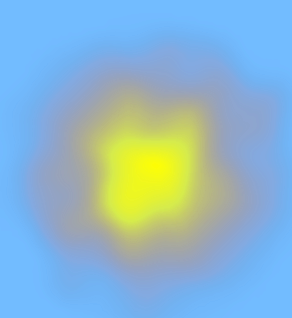
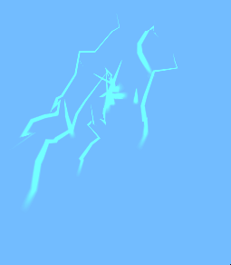

# VFX

A collection of visual effects for Unity made via particles systems and shaders (Shader Graph).

Rendering Pipeline: URP.

## Fire
Type: shader  

## Lightning
Type: particle system  

## Wind
Type: particle system  

## Magnetic Waves
Type: particle system  

